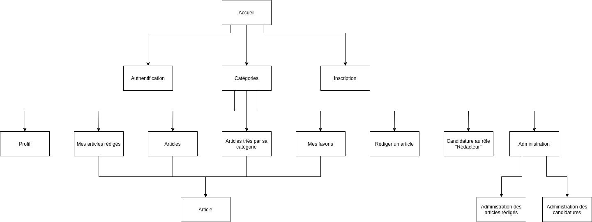

# Cahier des charges

## Sommaire

- [Cahier des charges](#cahier-des-charges)
  - [Sommaire](#sommaire)
  - [Présentation du projet](#présentation-du-projet)
  - [Objectifs du projet](#objectifs-du-projet)
  - [Définition du MVP (Minimum Viable Product)](#définition-du-mvp-minimum-viable-product)
  - [Décrire les fonctionnalités (version finale)](#décrire-les-fonctionnalités-version-finale)
    - [*Connexion* / *Authentification* + *Barre de Navigation* + *Pied de page* (présents sur chaque page)](#connexion--authentification--barre-de-navigation--pied-de-page-présents-sur-chaque-page)
    - [Page *Accueil*](#page-accueil)
    - [Page *Catégories* qui sert d'index au site](#page-catégories-qui-sert-dindex-au-site)
    - [Page *Articles* par catégorie](#page-articles-par-catégorie)
    - [Page *Articles* qui liste les articles](#page-articles-qui-liste-les-articles)
    - [Page *Article* qui liste un article à lire](#page-article-qui-liste-un-article-à-lire)
    - [Page *Mes favoris* qui liste les coups de coeur](#page-mes-favoris-qui-liste-les-coups-de-coeur)
    - [Page *Mes articles* qui liste les articles rédigés par un utilisateur](#page-mes-articles-qui-liste-les-articles-rédigés-par-un-utilisateur)
    - [Page *Rédiger un article*](#page-rédiger-un-article)
    - [Page *Inscription*](#page-inscription)
    - [Page *Authentification*](#page-authentification)
    - [Page *Profil*](#page-profil)
    - [Page *Devenir Rédacteur*](#page-devenir-rédacteur)
    - [Page *Administration*](#page-administration)
  - [Listing des technos choisies](#listing-des-technos-choisies)
    - [En Front](#en-front)
    - [En Back](#en-back)
  - [Les rôles définis pour les différents membres de l'équipe](#les-rôles-définis-pour-les-différents-membres-de-léquipe)
  - [Public visé pour l'application (cible)](#public-visé-pour-lapplication-cible)
  - [Potentielles évolutions](#potentielles-évolutions)
  - [Arborescence de l'application](#arborescence-de-lapplication)
  - [Listing des routes de l'API](#listing-des-routes-de-lapi)

## Présentation du projet

Le "Mur des Pensées" est un site proposant de regrouper divers articles rédigés par des auteurs amateurs, le tout sous différentes catégories.

Le principe est simple, vous pouvez naviguer sur le site en tant que simple "Visiteur", vous aurez donc la possibilité de lire les articles contenus dans les différentes catégories. A contrario, étant seulement "Visiteur", vous ne pourrez donc pas accéder à toutes les fonctionnalités du site. Pour se faire, vous pourrez vous inscrire sur le site en tant que "Lecteur" afin de lire vos articles, les mettre en favoris et voter pour vos préférés ! Mais ce n'est pas tout, vous pourrez aussi postuler au rôle de "Rédacteur" et donc obtenir la possibilité de rédiger des articles. Cette candidature sera ensuite vue par un "Rédacteur en Chef" qui acceptera ou non celle-ci !

Vous avez été accepté ! Avec votre nouveau rôle de "Rédacteur", vous pourrez rédiger des articles qui seront lus par les autres utilisateurs du site. Pour rédiger votre premier article, vous aurez accès à un éditeur de texte directement intégré à l'application. vous soumettrez le tout et il n'y aura plus qu'à attendre que le "Rédacteur en Chef" en vérifie le contenu et le valide.

## Objectifs du projet

Déployer une plateforme de publication d'articles rédigés par les utilisateurs et modérés par un rédacteur en chef.
Les articles sont publics et consultables par tous.

## Définition du MVP (Minimum Viable Product)

- MVP:
  - Inscription / Authentification
  - 2 Rôles : **"Visiteur"** et **"Rédacteur"**
  - Visualiser les articles (tous les rôles)
  - Modifier son profil (**"Rédacteur"**)
  - Rédiger des articles (**"Rédacteur"**)

## Décrire les fonctionnalités (version finale)

- Version finale :
  - Inscription / Authentification
  - 4 Rôles : **"Visiteur"**, **"Lecteur"**, **"Rédacteur"** et **"Rédacteur en Chef"**
  - Visualiser les articles (tous les rôles)
  - Modifier son profil (**"Lecteur"**, **"Rédacteur"** et **"Rédacteur en Chef"**)
  - Mettre une mention "j'aime" à un article (**"Lecteur"**, **"Rédacteur"** et **"Rédacteur en Chef"**)
  - Mettre en favori un article (**"Lecteur"**, **"Rédacteur"** et **"Rédacteur en Chef"**)
  - Postuler au rôle de **"Rédacteur"** (**"Lecteur"**)
  - Accepter / Refuser les candidatures (**"Rédacteur en Chef"**)
  - Rédiger des articles (**"Rédacteur"** et **"Rédacteur en Chef"**)
  - Accepter / Refuser un article (**"Rédacteur en Chef"**)

### *Connexion* / *Authentification* + *Barre de Navigation* + *Pied de page* (présents sur chaque page)

- **"Visiteur"**
  - Accès aux boutons *"Authentification / Inscription"*
  - Barre de Navigation :
    - Articles
    - Catégories
  - Pied de page
- **"Lecteur"**
  - Accès aux boutons *"Profil / Déconnexion"*
  - Barre de Navigation :
    - Articles
    - Catégories
    - Mes favoris
    - Devenir "Rédacteur"
  - Pied de page
- **"Rédacteur"**
  - Accès aux boutons *"Profil / Déconnexion"*
  - Barre de Navigation :
    - Articles
    - Catégories
    - Mes favoris
    - Rédiger un nouvel article
    - Mes articles
  - Pied de page
- **"Rédacteur en Chef"**
  - Accès aux boutons *"Profil / Déconnexion"*
  - Barre de Navigation :
    - Articles
    - Catégories
    - Mes favoris
    - Rédiger un nouvel article
    - Mes articles
    - Administration
  - Pied de page

### Page *Accueil*

- Présentation du site

### Page *Catégories* qui sert d'index au site

- Accès aux catégories d'articles

### Page *Articles* par catégorie

- Accès aux articles d'une catégorie

### Page *Articles* qui liste les articles

- Accès à tous les articles

### Page *Article* qui liste un article à lire

- **"Visiteur"** :
  - Page qui affiche l'article
- **"Lecteur"**, **"Rédacteur"** et **"Rédacteur en Chef"** :
  - Page qui affiche l'article
  - Boutons de vote et favori

### Page *Mes favoris* qui liste les coups de coeur

- **"Lecteur"**, **"Rédacteur"** et **"Rédacteur en Chef"** :
  - Accès aux articles favoris

### Page *Mes articles* qui liste les articles rédigés par un utilisateur

- **"Rédacteur"** et **"Rédacteur en Chef"** :
  - Accès aux articles rédigés

### Page *Rédiger un article*

- **"Rédacteur"** et **"Rédacteur en Chef"** :
  - Titre de l'article
  - Catégorie de l'article
  - Ajouter une image à l'article
  - Editeur de texte

### Page *Inscription*

- **"Visiteur"** :
  - Prénom
  - Nom
  - Email
  - Mot de passe
  - Confirmation du mot de passe
  - Choix de l'avatar

### Page *Authentification*

- **"Visiteur"** :
  - Email
  - Mot de passe

### Page *Profil*

- **"Lecteur"**, **"Rédacteur"** et **"Rédacteur en Chef"** :
  - Accès à un bouton ouvrant une modale permettant la modification des différents champs

### Page *Devenir Rédacteur*

- Champ de texte libre (textarea)

### Page *Administration*

- Articles à valider (ouverture d'une modale au clic)
- Candidatures à valider (ouverture d'une modale au clic)

## Listing des technos choisies

### En Front

- HTML5 / CSS3 : c'est la base d'un site web, c'est ce qui permet de définir son architecture
- React / Redux : outils vus pendantla spécialisation (frameworks fortement utilisé de nos jours)
- Semantic UI : framework React permettant de créer des interfaces simples et intuitives
- Axios : outil servant à la consommation de l'API

### En Back

- Node.js / Express : mise en place d'un serveur rapide et simple
- Sqitch : outil de gestion de base de données, il permet de faire du versionning
- PostgreSQL : base de données SQL vue pendant tout le socle et la spécialisation
- GraphQL / Apollo-Server : GraphQL apporte une meilleure personnalisation des requêtes, ce qui est idéal pour un site de type blog
- Redis : base de données clé / valeur très efficace pour de la mise en cache

## Les rôles définis pour les différents membres de l'équipe

- Dorian Garcia :
  - Product Owner
  - Scrum Master
  - Référent technique Back
- Alexandre Caffarelli :
  - Lead Dev Back
  - Git Master
- Jérémy Ponceau-Dallacasa
  - Lead Dev Front
- Anthony Gallego :
  - Référent des diverses librairies
- Marianne Girard :
  - Référente technique Front
  - Référente des diverses librairies

## Public visé pour l'application (cible)

Le projet "Mur des pensées" est destiné au plus grand nombre.

## Potentielles évolutions

- Ajout de commentaires aux articles
- Possibilité d'ajouter de nouvelles catégories
- Ajout de boutons de filtrage pour l'affichage des articles / catégories
- Mise en place de notifications pour la page administration (email, notifications visuelles, ...)
- Mise en place de notifications concernant le motif de refus d'un article ou d'une candidature par le **"Rédacteur en Chef"**

## Arborescence de l'application

## Listing des routes de l'API

Etant sur une API GraphQL, il n'y aura qu'une seule route de type POST : `base_url/graphql`
